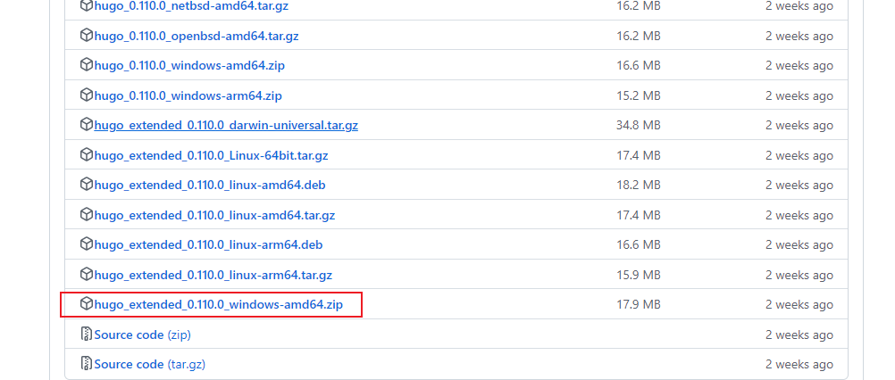

## Install

下载[hugo](https://github.com/gohugoio/hugo/releases)，设置环境变量，执行 `hugo version`​ 出版本号就说明可以用了。

然后找一个主题，`git clone`​到 themes 文件夹。

使用`hugo server`​即可在本地调试博客。

‍

如果在执行`hugo server`​ 的时候出现以下报错：

```bash
PS D:\Software\hugo\myblog> hugo server -t stack
WARN 2023/01/31 10:11:51 Module "stack" is not compatible with this Hugo version; run "hugo mod graph" for more information.
Start building sites …
hugo v0.110.0-e32a493b7826d02763c3b79623952e625402b168 windows/amd64 BuildDate=2023-01-17T12:16:09Z VendorInfo=gohugoio
Error: Error building site: TOCSS: failed to transform "scss/style.scss" (text/x-scss). Check your Hugo installation; you need the extended version to build SCSS/SASS with transpiler set to 'libsass'.: this feature is not available in your current Hugo version, see https://goo.gl/YMrWcn for more information
Built in 20 ms
```

说明该主题需要下载带有扩展包的hugo版本


‍

## Github Pages

#### 创建两个仓库

* 一个用于托管博客项目源文件，包括配置文件等包含后续可能配置 `API KEY`​ 的东西。设置权限为 *Private（不公开）*
* 一个用于托管博客编译后生成的`静态 Html 文件`​(即使用 hugo 命令编译生成的`public`​文件夹)，并配置该仓库使用 `Github Pages`​，然后 Github 就会自动检测到它其中的`静态Html文件`​并搭建网站。设置权限为 Public（公开）

#### 创建.gitignore

在源代码项目中创建`.gitignore`​文件，来防止把生成的静态文件上传。创建位置如下：

```bash
.
├── .git
├── .github
├── .gitignore  <---- 在根目录下
├── README.md
├── archetypes
├── config.toml
├── content
├── data
├── layouts
├── public
├── resources
├── static
└── themes
```

在`.gitignore`​中写入`/public`​，来防止 Git 将其上传。

```bash
cat .gitignore

## 输出
/public
```


## Tags and Categories
如果想加入标签，可以在每篇文章的页首这样设置（-后有空格）：
```toml
---
title: "使用Hugo搭建博客"
date: 2023-02-01T09:36:28+08:00
draft: false
categories: 
- Blog
tags: 
- Hugo
---
```


## Modify Font Style
修改字体样式似乎在每个主题的方法不一样，具体得看代码。
我用的是落霞孤鹜文楷体，找到head代码位置，直接引入
```html
<link rel="stylesheet" href="https://cdn.staticfile.org/lxgw-wenkai-screen-webfont/1.6.0/lxgwwenkaiscreen.css"media="print" onload="this.media='all'">
```
Loveit主题的话我是找到主题文件中的\themes\LoveIt\assets\css\_variables.scss，修改全局字体变量global-font-family如下：
```scss
// ========== Global ========== //
// Font and Line Height
$global-font-family: "LXGW WenKai Screen", system-ui, -apple-system, Segoe UI, Roboto, Emoji, Helvetica, Arial, sans-serif !default;
$global-font-size: 16px !default;
$global-font-weight: 400 !default;
$global-line-height: 1.5rem !default;
```


## Error
在使用主题Loveit时候遇到的问题

```bash
ERROR Failed to read Git log: fatal: not a git repository
```

Solution：

```toml
# 修改config.toml
# 是否使用 git 信息
enableGitInfo = false
```


## Reference
[Loveit 主题官方教程](https://hugoloveit.com/zh-cn/)

[Hugo Quick Start](https://gohugo.io/getting-started/quick-start/)

[少数派写作指南](https://sspai.com/post/37815)
